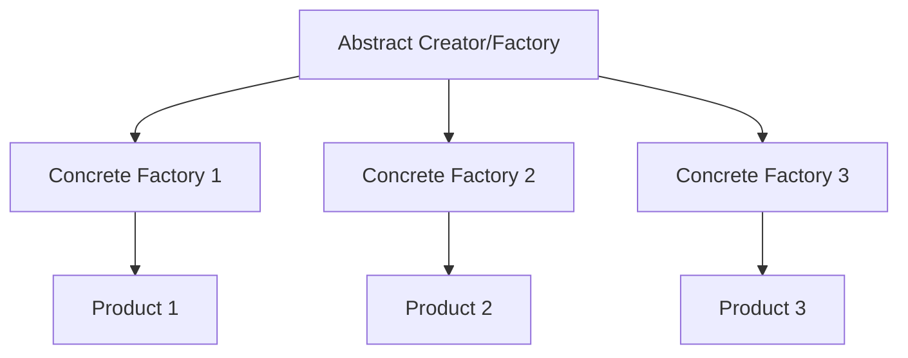

## Kesa?

The Factory Method Pattern defines an interface for creating objects, but lets subclasses decide which class to instantiate. It allows the superclass to defer object instantiation to its subclasses.

> [!tip] Core Concept Factory creates objects for you, rather than you creating objects directly with `new`. The factory defines an overall structure, and every time a new product is required, you can just use the `createProduct()` method to create a new variant of it.

---

## Key Components

### 1. **Abstract Product** 
Defines the interface for objects the factory method creates. eg. Vehical(ABC) 

### 2. **Concrete Products**
Specific implementations of the abstract product. eg. Tractor(Vehical)

### 3. **Abstract Creator (Factory)**
Declares the factory method that returns a product object. eg. FactoryVehical()

### 4. **Concrete Creators**
Override the factory method to return specific product instances. eg. TractorFactory() : 

---

## Workflow (Layman's Terms)

1. The **parent** is called the **Creator**
2. The Creator must be **ABSTRACT** and enforces all of its children to implement the methods
3. The **Factory** has control to create products only
4. We use the factory to create whatever we want



---

## Two Variants

### 1. Simple Factory Method 

- Factory creation is handled for every single product in the **same factory maker**
- Uses static methods or a single class with conditional logic
- **Not the true Factory Method Pattern**

### 2. Ideal Factory Method 

- Uses the Factory maker pattern with **concrete creator classes**
- Each factory is a separate class that creates its specific product
- **True Factory Method Pattern**

---

## Example: Payment Gateway System

### Components Breakdown

- **Abstract Product** → `Payment`
- **Concrete Products** → `CreditCardPayment`, `DebitCardPayment`, `UPIPayment`
- **Abstract Creator (Factory)** → `PaymentProcessor`
- **Concrete Factories** → `CreditCardProcessor`, `DebitCardProcessor`, `UPIProcessor`

---

## Implementation

### Simple Factory (Not True Factory Method)

```python
from abc import ABC, abstractmethod

# Abstract Product
class Payment(ABC):
    @abstractmethod
    def make_payment(self):
        pass

# Concrete Products
class CreditCardPayment(Payment):
    def make_payment(self):
        print("Making payment with credit card")

class DebitCardPayment(Payment):
    def make_payment(self):
        print("Making payment with debit card")

class UPIPayment(Payment):
    def make_payment(self):
        print("Making payment with UPI")

# Simple Factory (Static Factory)
class PaymentFactory:
    @staticmethod
    def create_payment(payment_type):
        """
        Creates payment based on type
        
        :param payment_type: Type of payment (credit/debit/upi)
        :return: Payment instance
        """
        if payment_type == "credit":
            return CreditCardPayment()
        elif payment_type == "debit":
            return DebitCardPayment()
        elif payment_type == "upi":
            return UPIPayment()
        else:
            raise ValueError("Invalid payment type")

# Usage
if __name__ == "__main__":
    payment_type = input("Enter payment type (credit/debit/upi): ")
    payment = PaymentFactory.create_payment(payment_type)
    payment.make_payment()
```

**Issues with Simple Factory:**

- Violates Open/Closed Principle (must modify factory for new products)
- All creation logic centralized in one place
- Not extensible without modification

---

### Ideal Factory Method Pattern

```python
from abc import ABC, abstractmethod

# Abstract Product
class Payment(ABC):
    @abstractmethod
    def make_payment(self):
        pass

# Concrete Products
class CreditCardPayment(Payment):
    def make_payment(self):
        print("Making payment with credit card")

class DebitCardPayment(Payment):
    def make_payment(self):
        print("Making payment with debit card")

class UPIPayment(Payment):
    def make_payment(self):
        print("Making payment with UPI")

class SomePro(Payment) : 
	def make_payment(self) : 
		print("Doing something")

# Abstract Creator (Factory Interface)
class PaymentProcessor(ABC):
    @abstractmethod
    def create_payment(self) -> Payment:
        """Factory method - subclasses override this"""
        pass
    
    def process_payment(self):
        """Template method that uses the factory method"""
        payment = self.create_payment()
        payment.make_payment()

# Concrete Creators (Concrete Factories)
class CreditCardProcessor(PaymentProcessor):
    def create_payment(self) -> Payment:
        return CreditCardPayment()

class DebitCardProcessor(PaymentProcessor):
    def create_payment(self) -> Payment:
        return DebitCardPayment()

class UPIProcessor(PaymentProcessor):
    def create_payment(self) -> Payment:
        return UPIPayment()
	

# Usage
if __name__ == "__main__":
    payment_type = input("Enter payment type (credit/debit/upi): ")
    
    # Select the appropriate processor
    # all the changing code comes in the main method wali shit
    if payment_type == "credit":
        processor = CreditCardProcessor()
    elif payment_type == "debit":
        processor = DebitCardProcessor()
    elif payment_type == "upi":
        processor = UPIProcessor()
    else:
        raise ValueError("Invalid payment type")
    
    processor.process_payment()
```

**Advantages of Ideal Factory Method:**

- Follows Open/Closed Principle (extend by adding new classes)
- Each factory has single responsibility
- Easy to add new payment types without modifying existing code
- Encapsulates object creation logic in dedicated classes

---

## Comparison Table

| Aspect                    | Simple Factory                                     | Factory Method Pattern                         |
| ------------------------- | -------------------------------------------------- | ---------------------------------------------- |
| **Structure**             | Single factory class with static/conditional logic | Abstract creator + concrete creator subclasses |
| **Extensibility**         | Must modify factory class to add new types         | Add new creator subclass (no modification)     |
| **Coupling**              | All creation logic in one place                    | Distributed across subclasses                  |
| **Open/Closed Principle** | Violates                                           |  Follows                                       |
| **Use Case**              | Simple object creation                             | Complex creation logic that varies by type     |
| **Complexity**            | Lower                                              | Higher                                         |

---

## When to Use

### Use Simple Factory When:

- You have simple object creation needs
- Creation logic doesn't vary significantly
- You want centralized control over creation
- Small number of product types

### Use Factory Method When:

- Subclasses need to decide which objects to create
- Creation involves complex logic that varies by type
- You want to follow SOLID principles strictly
- You need to extend the system without modifying existing code
- You have many product variants

---

## Key Benefits

1. **Loose Coupling** - Client code depends on abstractions, not concrete classes
2. **Single Responsibility** - Creation logic separated from business logic
3. **Open/Closed Principle** - Open for extension, closed for modification
4. **Flexibility** - Easy to introduce new product types

---
