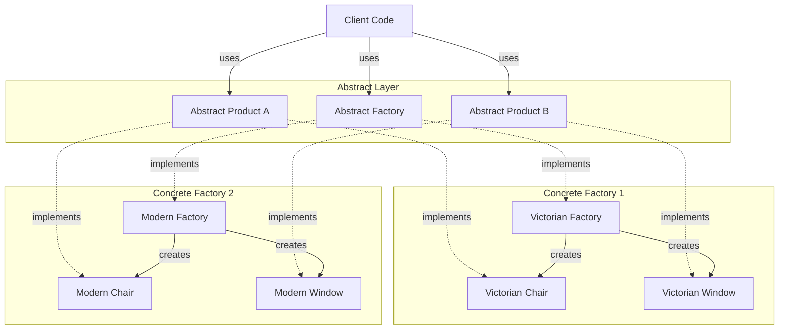
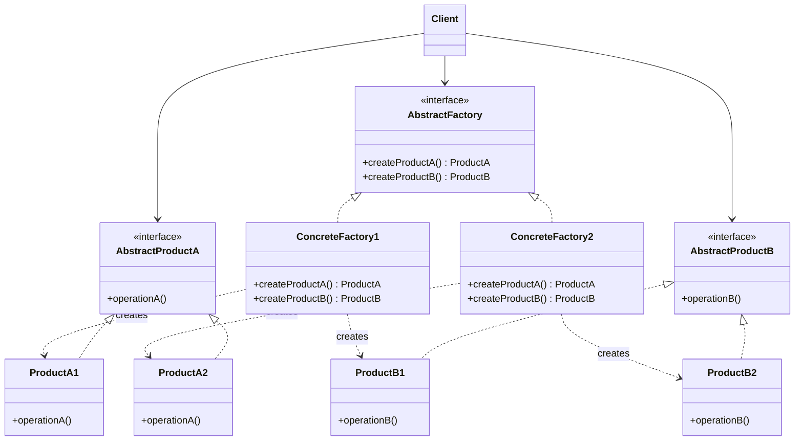
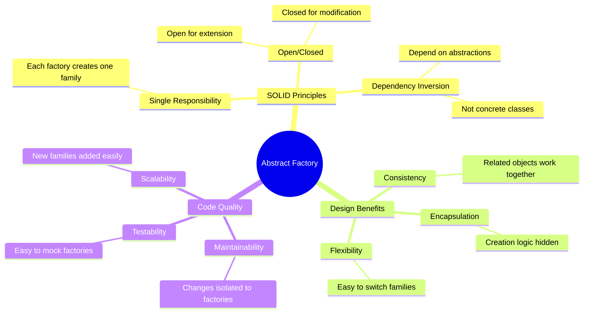
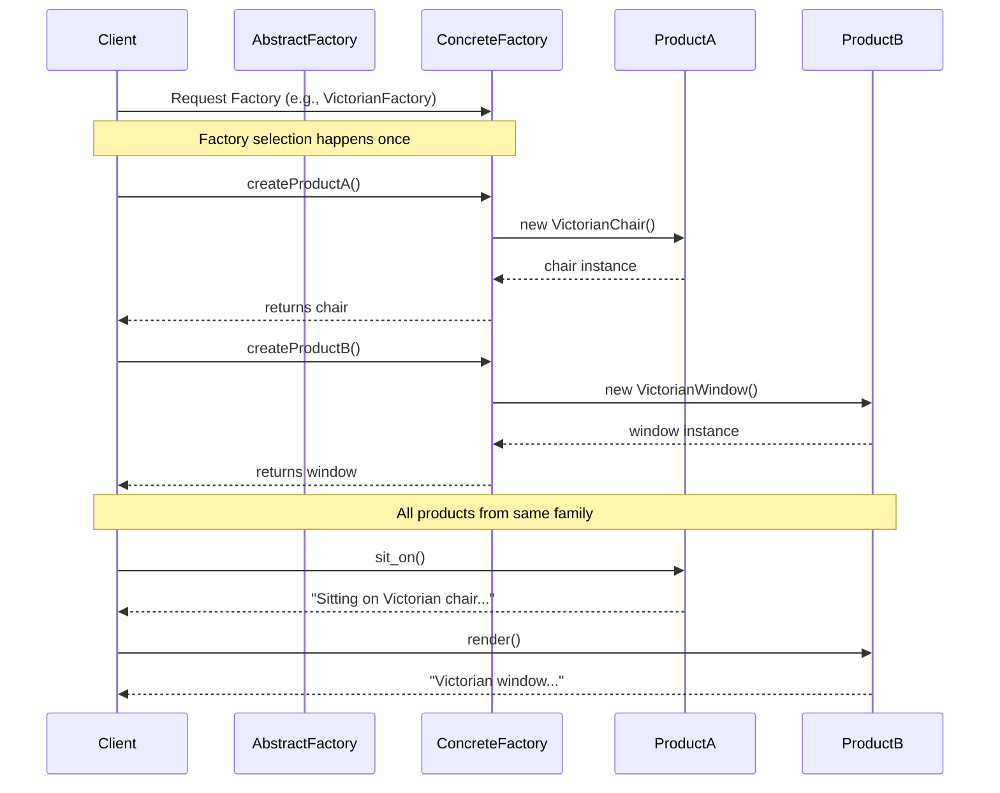

**Abstract Factory** is a creational design pattern that lets you produce families of related objects without specifying their concrete classes.

> [!tip] Core Concept Abstract Factory produces products (or objects) that belong to the same family, while ensuring that the products are compatible with each other. Rather than modifying every instance of the object directly, the factory defines an overall structure, and concrete factories create specific product families that work together seamlessly.

---
## Key Components

- **Abstract Factory**: Defines an interface for creating objects in related families

- **Concrete Factories**: These implement the abstract factory and actually create specific objects from a particular family.

- **Abstract Products**: Interfaces or abstract classes that define the structure of the product.

- **Concrete Products**: Specific implementations of the abstract products that belong to a specific family/variant.

- **Client**: Uses only the interfaces declared by Abstract Factory and Abstract Product classes.

---

## Workflow (Layman's Terms)

1. **Define Abstract Products**: Create interfaces for each type of product (e.g., Chair, Window).
2. **Create Concrete Products**: Implement these interfaces for different variants (Victorian, Modern, etc.).
3. **Define Abstract Factory**: Create an interface that declares creation methods for all abstract products.
4. **Implement Concrete Factories**: Each concrete factory creates a complete family of products (all Victorian or all Modern).
5. **Client Code**: Works with factories and products through their abstract interfaces.



---

## UML Class Diagram



---

## Example: Furniture Store with Styled Products

### Components Breakdown

- **Abstract Products** → `Window` and `Chair`
- **Concrete Products** → `VictorianChair`, `VictorianWindow`, `ModernChair`, `ModernWindow`
- **Abstract Factory** → `FurnitureFactory`
- **Concrete Factories** → `VictorianFactory`, `ModernFactory`
- **Client** → `furnish_room()` function

---

## Implementation

### ✅ Complete Abstract Factory Pattern Implementation

```python
from abc import ABC, abstractmethod

# ==================== Abstract Products ====================

class Window(ABC):
    """Abstract product interface for windows"""
    @abstractmethod
    def render(self) -> str:
        pass

class Chair(ABC):
    """Abstract product interface for chairs"""
    @abstractmethod
    def sit_on(self) -> str:
        pass

# ==================== Concrete Products - Victorian Family ====================

class VictorianWindow(Window): 
    def render(self) -> str:
        return "Victorian window with ornate frame and stained glass"
class VictorianChair(Chair): 
    def sit_on(self) -> str:
        return "Sitting on Victorian chair with carved wood and velvet cushion"

class ModernWindow(Window): 
    def render(self) -> str:
        return "Modern window with minimalist aluminum frame and large glass panels"
class ModernChair(Chair): 
    def sit_on(self) -> str:
        return "Sitting on modern chair with clean lines and ergonomic design"
        
class ArtDecoWindow(Window): 
    def render(self) -> str:
        return "Art Deco window with geometric patterns and bold colors"
class ArtDecoChair(Chair): 
    def sit_on(self) -> str:
        return "Sitting on Art Deco chair with luxurious materials and angular design"

# ==================== Abstract Factory ====================

class FurnitureFactory(ABC):
    @abstractmethod
    def create_window(self) -> Window:
        pass
    @abstractmethod
    def create_chair(self) -> Chair:
        pass

# ==================== Concrete Factories ====================

class VictorianFactory(FurnitureFactory): 
    def create_window(self) -> Window:
        return VictorianWindow()
    def create_chair(self) -> Chair:
        return VictorianChair()

class ModernFactory(FurnitureFactory): 
    def create_window(self) -> Window:
        return ModernWindow()
    def create_chair(self) -> Chair:
        return ModernChair()

class ArtDecoFactory(FurnitureFactory): 
    def create_window(self) -> Window:
        return ArtDecoWindow()
    def create_chair(self) -> Chair:
        return ArtDecoChair()

# ==================== Client ====================

def furnish_room(factory: FurnitureFactory) -> None:
    """
    Client code works with factories and products only through abstract types.
    This allows passing any factory or product subclass to the client code
    without breaking it.
    """
    window = factory.create_window()
    chair = factory.create_chair()
    
    print(f"  🪟 {window.render()}")
    print(f"  🪑 {chair.sit_on()}")
    print()

# ==================== Usage Example ====================

if __name__ == "__main__":
    print("=" * 60)
    print("FURNITURE STORE - ABSTRACT FACTORY PATTERN DEMO")
    print("=" * 60)
    print()
    
    print("  Victorian Style Room:")
    furnish_room(VictorianFactory())
    
    print(" Modern Style Room:")
    furnish_room(ModernFactory())
    
    print(" Art Deco Style Room:")
    furnish_room(ArtDecoFactory())
    
    # Demonstrating that we can easily switch families
    print("Customer changes mind - switching to Modern:")
    customer_choice: FurnitureFactory = ModernFactory()
    furnish_room(customer_choice)
```


---

## Real-World Example: Cross-Platform UI Components

```python
from abc import ABC, abstractmethod

# ==================== Abstract Products ====================

class Button(ABC):
    @abstractmethod
    def render(self) -> str:
        pass
    
    @abstractmethod
    def on_click(self) -> str:
        pass

class Checkbox(ABC):
    @abstractmethod
    def render(self) -> str:
        pass
    
    @abstractmethod
    def toggle(self) -> str:
        pass

# ==================== Windows Products ====================

class WindowsButton(Button):
    def render(self) -> str:
        return "Rendering Windows-style button with Win11 design"
    
    def on_click(self) -> str:
        return "Windows button clicked - Windows event triggered"

class WindowsCheckbox(Checkbox):
    def render(self) -> str:
        return "Rendering Windows-style checkbox"
    
    def toggle(self) -> str:
        return "Windows checkbox toggled"

# ==================== macOS Products ====================

class MacOSButton(Button):
    def render(self) -> str:
        return "Rendering macOS-style button with Aqua design"
    
    def on_click(self) -> str:
        return "macOS button clicked - Cocoa event triggered"

class MacOSCheckbox(Checkbox):
    def render(self) -> str:
        return "Rendering macOS-style checkbox"
    
    def toggle(self) -> str:
        return "macOS checkbox toggled"

# ==================== Linux Products ====================

class LinuxButton(Button):
    def render(self) -> str:
        return "Rendering Linux-style button with GTK theme"
    
    def on_click(self) -> str:
        return "Linux button clicked - GTK signal emitted"

class LinuxCheckbox(Checkbox):
    def render(self) -> str:
        return "Rendering Linux-style checkbox"
    
    def toggle(self) -> str:
        return "Linux checkbox toggled"

# ==================== Abstract Factory ====================

class GUIFactory(ABC):
    @abstractmethod
    def create_button(self) -> Button:
        pass
    
    @abstractmethod
    def create_checkbox(self) -> Checkbox:
        pass

# ==================== Concrete Factories ====================

class WindowsFactory(GUIFactory):
    def create_button(self) -> Button:
        return WindowsButton()
    
    def create_checkbox(self) -> Checkbox:
        return WindowsCheckbox()

class MacOSFactory(GUIFactory):
    def create_button(self) -> Button:
        return MacOSButton()
    
    def create_checkbox(self) -> Checkbox:
        return MacOSCheckbox()

class LinuxFactory(GUIFactory):
    def create_button(self) -> Button:
        return LinuxButton()
    
    def create_checkbox(self) -> Checkbox:
        return LinuxCheckbox()

# ==================== Application ====================

class Application:
    def __init__(self, factory: GUIFactory):
        self.factory = factory
        self.button = factory.create_button()
        self.checkbox = factory.create_checkbox()
    
    def render(self):
        print(self.button.render())
        print(self.checkbox.render())
    
    def interact(self):
        print(self.button.on_click())
        print(self.checkbox.toggle())

# ==================== Usage ====================

def configure_application() -> GUIFactory:
    """Detect OS and return appropriate factory"""
    import platform
    os_name = platform.system()
    
    if os_name == "Windows":
        return WindowsFactory()
    elif os_name == "Darwin":  # macOS
        return MacOSFactory()
    else:  # Linux
        return LinuxFactory()

if __name__ == "__main__":
    # Application is configured once with the appropriate factory
    factory = configure_application()
    app = Application(factory)
    
    print("Rendering UI components:")
    app.render()
    print("\nUser interactions:")
    app.interact()
```

---

## Comparison: Factory Method vs Abstract Factory

| Aspect                    | Factory Method Pattern                               | Abstract Factory Pattern                                  |
| ------------------------- | ---------------------------------------------------- | --------------------------------------------------------- |
| **Purpose**               | Create one product at a time                         | Create families of related products                       |
| **Structure**             | Single factory class with creation method            | Multiple factory classes, each creating product families  |
| **Complexity**            | Simpler, focuses on single product                   | More complex, manages multiple related products           |
| **Number of Products**    | One product type per factory                         | Multiple product types per factory                        |
| **Product Relationship**  | Products are independent                             | Products are designed to work together                    |
| **Extensibility**         | Add new creator subclass for new product             | Add new factory for new product family                    |
| **Use Case**              | When you need to create different types of one thing | When you need families of compatible objects              |
| **Example**               | PaymentProcessor → CreditCard, Debit, UPI            | FurnitureFactory → {Victorian: Chair+Window, Modern: ...} |
| **Open/Closed Principle** | ✅ Follows                                            | ✅ Follows                                                 |
| **Client Knowledge**      | Client knows which concrete factory to use           | Client works only with abstract factory interface         |

---

## When to Use Abstract Factory Pattern

###  Use Abstract Factory When:

1. **Product Families**: Your system needs to work with multiple families of related products
    - Example: UI components for different platforms (Windows, macOS, Linux)

2. **Consistency Required**: Products from the same family must be used together
    - Example: Victorian chair should match Victorian window, not Modern window
    
3. **Platform Independence**: You want to shield client code from concrete product classes
    - Example: Database access layer supporting MySQL, PostgreSQL, MongoDB families

4. **Runtime Configuration**: The product family should be selected at runtime
    - Example: Theme selection in an application (Dark Mode, Light Mode, High Contrast)

5. **Future Extensions**: You anticipate adding more product families in the future
    - Example: Adding new furniture styles without changing existing code

### Don't Use Abstract Factory When:

1. **Simple Creation**: You only need to create one type of object
    - Use Factory Method or Simple Factory instead
2. **No Product Families**: Your products don't have variants or families
    - Regular constructors or Builder pattern might suffice
3. **Overhead Concern**: The pattern introduces too much complexity for your simple use case
    - Keep it simple if you don't need the flexibility

---

## Advantages & Disadvantages

### ✅ Advantages

1. **Loose Coupling**: Client code is isolated from concrete product classes
2. **Consistency**: Ensures products from the same family are compatible
3. **Single Responsibility Principle**: Product creation code is in one place
4. **Open/Closed Principle**: New product families can be added without modifying existing code
5. **Flexibility**: Easy to swap entire product families at runtime

### ❌ Disadvantages

1. **Complexity**: Introduces many new interfaces and classes
2. **Rigid Structure**: Adding new product types requires updating all factory interfaces
3. **Overhead**: May be overkill for simple scenarios
4. **Learning Curve**: More complex than simpler creational patterns

---
## IMP How to Implement Abstract factory design pattern .
1.  Map out a matrix of distinct product types versus variants of these products.
    
2. Declare abstract product interfaces for all product types. Then make all concrete product classes implement these interfaces.
    
3. Declare the abstract factory interface with a set of creation methods for all abstract products.
    
4. Implement a set of concrete factory classes, one for each product variant.
    
5. Create factory initialization code somewhere in the app. It should instantiate one of the concrete factory classes, depending on the application configuration or the current environment. Pass this factory object to all classes that construct products.
    
6. Scan through the code and find all direct calls to product constructors. Replace them with calls to the appropriate creation method on the factory object.

### ✅ Advantages

1. **Loose Coupling**: Client code is isolated from concrete product classes
2. **Consistency**: Ensures products from the same family are compatible
3. **Single Responsibility Principle**: Product creation code is in one place
4. **Open/Closed Principle**: New product families can be added without modifying existing code
5. **Flexibility**: Easy to swap entire product families at runtime

## Key Principles Followed



---

## Process Flow Diagram



---

## Common Pitfalls & Best Practices

### ⚠️ Common Pitfalls

1. **Over-Engineering**: Using Abstract Factory when a simpler pattern would suffice
2. **Tight Coupling**: Making client code aware of concrete factories
3. **Incomplete Families**: Not implementing all products in a family
4. **Mixed Families**: Accidentally mixing products from different families

### ✅ Best Practices

1. **Use Dependency Injection**: Pass factories to clients via constructor or method parameters
2. **Configuration-Based Selection**: Use config files to determine which factory to use
3. **Complete Families**: Ensure all concrete factories implement all product creation methods
4. **Naming Conventions**: Use clear naming like `VictorianFactory`, `ModernFactory`
5. **Return Interfaces**: Factory methods should return abstract product types, not concrete ones

---

## Summary

The **Abstract Factory Pattern** is a powerful creational design pattern that provides an interface for creating families of related or dependent objects without specifying their concrete classes. It's particularly useful when:

- You need to ensure products from the same family work together
- You want to provide a library of products revealing only interfaces, not implementations
- Your system should be independent of how its products are created
- You want to enforce constraints about which products can be used together

By following this pattern, you create flexible, maintainable code that adheres to SOLID principles and is easy to extend with new product families.

---


---

_Last Updated: February 2026_