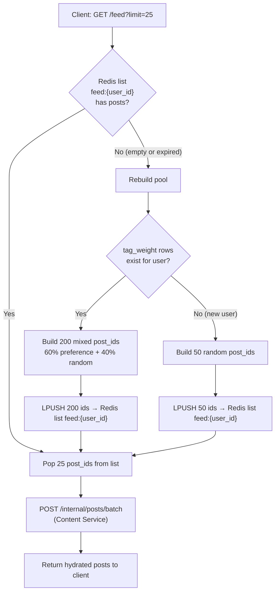

# Feed Algorithm — Build Plan

> How Feed Service (`:8003`) builds a personalized, paginated feed for `GET /api/v1/feed`.
> All data lives in Feed Service's own DB + Redis. Only one interservice call at the end.

---

## High-Level Flow




---

## Schema Additions (Feed Service DB)

The existing Feed Service schema (`tags`, `post_tags`, `tag_weight`) needs one new table to track which posts have been served/seen by a user.

```dbml
Table feed_post_seen {
  user_id    int       [not null]
  post_id    int       [not null]
  seen_at    timestamp

  indexes {
    (user_id, post_id) [pk]
    (user_id, seen_at) [note: 'optional: retention cleanup by date']
  }
}
```

**Populated by two sources:**


| Source                                 | When                                                                               |
| -------------------------------------- | ---------------------------------------------------------------------------------- |
| `post.viewed` events from Redis Stream | User opened a post in Content Service                                              |
| Feed serve-time                        | Feed Service inserts rows for the 25 post_ids it just served (prevents re-showing) |


> `post_tags` already contains every post_id (via `post.created` events), so it doubles as the post universe — no separate `post_registry` table needed.

---

## Step-by-Step Algorithm

### Step 1 — Check Redis cache

```
Key:   feed:{user_id}
Type:  Redis List
TTL:   10 minutes (safety net; normally drained before expiry)
```

- If the list exists and has items → skip to **Step 6** (pop and serve).
- If empty or missing → proceed to **Step 2** (rebuild).

---

### Step 2 — Get top-K tags for the user

```sql
SELECT tag_id, weight
FROM tag_weight
WHERE user_id = :uid
ORDER BY weight DESC
LIMIT :K                       -- K = 10–20 (tunable)
```

Uses index `idx_user_top_tags (user_id, weight)` — fast.

- If **zero rows** → user is new, jump to **Step 5 (cold start)**.
- Otherwise → proceed to **Step 3**.

---

### Step 3 — Build a pool:-  

Get unseen posts that match the user's top tags:

```sql
SELECT DISTINCT pt.post_id
FROM post_tags pt
WHERE pt.tag_id IN (:top_k_tag_ids)
  AND pt.post_id NOT IN (
      SELECT post_id FROM feed_post_seen WHERE user_id = :uid
  )
ORDER BY pt.post_id DESC      -- recency bias (higher id = newer post)
LIMIT 120
```

- Uses the reverse index `(tag_id, post_id)` on `post_tags`.
- `NOT IN` subquery excludes everything the user has seen or been served.
- `ORDER BY post_id DESC` gives a recency bias — newer posts surface first.

---

### Step 4 -- Build the random/discovery pool: 

Get unseen posts that are NOT in the preference pool:

```sql
SELECT DISTINCT pt.post_id
FROM post_tags pt
WHERE pt.post_id NOT IN (
      SELECT post_id FROM feed_post_seen WHERE user_id = :uid
  )
  AND pt.post_id NOT IN (:preference_pool_ids)
ORDER BY RANDOM()
LIMIT 80
```

- Source is all posts in `post_tags` (the full post universe).
- Excludes seen posts AND the 120 preference posts (no duplicates).
- `ORDER BY RANDOM()` for discovery/serendipity.

> **v2 optimization:** Replace `ORDER BY RANDOM()` with `TABLESAMPLE` or pre-bucketed random selection if this becomes slow on large tables.

**Combine:** `pool = preference_pool + random_pool`, then shuffle the combined list to interleave them naturally.

→ Proceed to **Step 5b** (push to Redis).

---

### Step 5 — Cold start (new user, no tag_weight)

```sql
SELECT DISTINCT pt.post_id
FROM post_tags pt
WHERE pt.post_id NOT IN (
      SELECT post_id FROM feed_post_seen WHERE user_id = :uid
  )
ORDER BY RANDOM()
LIMIT 50
```

- 50 posts (2 pages) to start slow.
- Pure random since there's no preference signal yet.
- Once the user likes or comments, `tag_weight` rows appear (from `post.liked` / `comment.created` events), and the next rebuild uses the normal 60/40 logic automatically. No special graduation logic needed.

---

### Step 5b — Push pool to Redis

```
LPUSH feed:{user_id}  <post_id_1> <post_id_2> ... <post_id_N>
EXPIRE feed:{user_id}  600        -- 10 min TTL safety net
```


| User type        | Pool size | Pages available (25/page) |     |
| ---------------- | --------- | ------------------------- | --- |
| Normal           | 200       | 8 pages                   |     |
| New (cold start) | 50        | 2 pages                   |     |


---

### Step 6 — Serve a page (pop 25 from Redis)

```
post_ids = LPOP feed:{user_id} 25
```

This atomically removes 25 ids from the front of the list.

**Mark as served** — bulk insert into `feed_post_seen`:

```sql
INSERT INTO feed_post_seen (user_id, post_id, seen_at)
VALUES (:uid, :pid_1, NOW()), (:uid, :pid_2, NOW()), ...
ON CONFLICT (user_id, post_id) DO NOTHING
```

This prevents these posts from appearing in future rebuilds regardless of whether the user actually opens them.

---

### Step 7 — Hydrate via Content Service (single interservice call)

```
POST http://content-service:8002/internal/posts/batch
Body: { "post_ids": [42, 43, 44, ...] }
```

Content Service returns full post objects (title, author, like_count, etc.).

**Handle deleted posts gracefully:** Content Service may return fewer posts than requested if some were deleted. Return whatever comes back, even if it's 23 instead of 25.

---

### Step 8 — Return to client

```json
{
  "posts": [
    { "id": 42, "title": "...", "author_uname": "alice", "author_avatar": "url",
      "like_count": 15, "comment_count": 7, "created_at": "..." },
    ...
  ],
  "has_more": true
}
```

- `has_more`: `true` if the Redis list still has items OR the DB has unseen posts.
- No cursor needed — the server manages state via the Redis list. Each request just pops the next batch.

---

## Pagination Lifecycle

```
Page 1:  Client → GET /feed             → Redis empty → rebuild 200 → pop 25 → return
Page 2:  Client → GET /feed             → Redis has 175 → pop 25 → return
Page 3:  Client → GET /feed             → Redis has 150 → pop 25 → return
...
Page 8:  Client → GET /feed             → Redis has 25 → pop 25 → return
Page 9:  Client → GET /feed             → Redis empty → rebuild next 200 → pop 25 → return
```

- No cursor, no offset from the client.
- Each rebuild naturally excludes all previously served posts (via `feed_post_seen`).
- The client just keeps calling `GET /feed` — the server handles everything.

---

## Adaptive Ratio

The 60/40 split adjusts based on available preference posts:

```python
top_tags = get_top_k_tags(user_id, K=15)

if not top_tags:
    # Cold start — no history at all
    pool = get_random_unseen_posts(user_id, limit=50)

else:
    preference = get_preference_posts(user_id, top_tags, limit=120)

    if len(preference) < 30:
        # Thin history — lean into random
        random_limit = 200 - len(preference)
    elif len(preference) < 80:
        # Moderate history
        random_limit = 120
    else:
        # Normal — 60/40 split
        random_limit = 80

    random = get_random_unseen_posts(user_id, exclude=preference, limit=random_limit)
    pool = shuffle(preference + random)
```

---

## Event Consumption (Redis Stream → Feed Service)

The `feed_svc` consumer group processes these events to keep Feed Service data current:


| Event             | Feed Service action                                                              |
| ----------------- | -------------------------------------------------------------------------------- |
| `post.created`    | Resolve/create `tags` rows, insert `post_tags` rows, increment `tags.post_count` |
| `post.deleted`    | Remove `post_tags` rows, decrement `tags.post_count`                             |
| `post.liked`      | UPSERT `tag_weight` +1 for each tag on the post                                  |
| `post.unliked`    | UPSERT `tag_weight` -1 for each tag on the post                                  |
| `comment.created` | UPSERT `tag_weight` +5 for each tag on the post                                  |
| `post.viewed`     | INSERT into `feed_post_seen` (user has opened this post)                         |


---

## Redis Key Design


| Key              | Type | Content                           | TTL    |
| ---------------- | ---- | --------------------------------- | ------ |
| `feed:{user_id}` | List | Ordered post_ids for next N pages | 10 min |


Memory per user: ~200 post_ids × 8 bytes = **1.6 KB**. For 10K concurrent users = **16 MB**. Negligible.

---

## Edge Cases


| Scenario                                 | Handling                                                                                                                                                                               |
| ---------------------------------------- | -------------------------------------------------------------------------------------------------------------------------------------------------------------------------------------- |
| **New user, zero history**               | Cold start path: 50 random posts, 2 pages. Auto-graduates when interactions create `tag_weight` rows.                                                                                  |
| **User exhausts all unseen posts**       | Rebuild returns an empty pool. Return `{ "posts": [], "has_more": false }`. Rare unless the platform is very small.                                                                    |
| **Post deleted while in Redis cache**    | `/internal/posts/batch` returns fewer results. Serve whatever Content Service returns.                                                                                                 |
| **User inactive, Redis TTL expires**     | Next request triggers a rebuild. No data loss — `feed_post_seen` in DB is the source of truth for exclusion.                                                                           |
| `**feed_post_seen` grows unbounded**     | Add periodic cleanup: delete rows older than 90 days. After 90 days, re-surfacing old posts is acceptable.                                                                             |
| **Concurrent requests (race condition)** | Two simultaneous `GET /feed` calls could both see an empty list and both trigger rebuilds. Use a Redis `SETNX` lock (`feed_lock:{user_id}`, 5s TTL) — second request waits or retries. |


---

## Performance Characteristics


| Operation                   | Cost                                                                                                                                |
| --------------------------- | ----------------------------------------------------------------------------------------------------------------------------------- |
| Check Redis list            | O(1)                                                                                                                                |
| Pop 25 from list            | O(1) — LPOP with count                                                                                                              |
| Rebuild: top-K tags         | Index scan on `idx_user_top_tags` — fast                                                                                            |
| Rebuild: preference posts   | Index scan on `post_tags (tag_id, post_id)` — fast                                                                                  |
| Rebuild: random posts       | `ORDER BY RANDOM()` — full scan of eligible rows. Fine for < 100K posts. Optimize later with `TABLESAMPLE` or materialized buckets. |
| Mark served                 | Bulk INSERT 25 rows — negligible                                                                                                    |
| Hydrate via Content Service | Single HTTP call, batch query by primary key — fast                                                                                 |


**Hot path (pages 2–8):** Redis pop + one HTTP call. Sub-10ms server-side before Content Service latency.

**Cold path (rebuild):** 2–3 DB queries + Redis push + pop + one HTTP call. ~50–100ms for moderate-sized tables.

---

## Summary

```
GET /feed
  │
  ├─ Redis list exists? ──YES──→ Pop 25 → Mark seen → Batch fetch → Return
  │
  └─ NO (rebuild)
       │
       ├─ tag_weight exists? ──YES──→ Top-K tags
       │                                 │
       │                                 ├─ Preference pool (120 unseen, by tag match, recency bias)
       │                                 ├─ Random pool (80 unseen, not in preference)
       │                                 └─ Shuffle + push 200 → Redis
       │
       └─ NO (cold start) ──→ 50 random unseen → push → Redis
                                       │
                                       └─ Pop 25 → Mark seen → Batch fetch → Return
```


some hot points :   
Created `feed_algorithm.md` with the complete plan. Here's what it covers:

1. **Full flow diagram** (Mermaid) showing the decision tree from client request to response
2. **Schema addition** — `feed_post_seen` table for tracking served/viewed posts locally
3. **Step-by-step algorithm** (Steps 1–8) with exact SQL queries for each stage
4. **Pagination lifecycle** — no cursor needed, server manages state via Redis list. Client just keeps calling `GET /feed`
5. **Adaptive ratio** — adjusts the 60/40 preference/random split based on how much preference content exists (handles thin history gracefully)
6. **Event consumption table** — what the `feed_svc` consumer does with each Redis Stream event
7. **Redis key design** — `feed:{user_id}` as a List, ~1.6 KB per user
8. **Edge cases** — cold start, post deletion mid-cache, TTL expiry, unbounded `feed_post_seen` growth (90-day cleanup), and concurrent request race conditions (Redis lock)
9. **Performance characteristics** — hot path is sub-10ms (just Redis pop + HTTP call), cold path (rebuild) is ~50-100ms


DAWG: 
1. req : uid, offset. 
steps :-> 
2. get the users top k tags. 
3. get new post from these (so outer join -> [Post_Seen] _OJ_ [all the post with thse joins] 
	10 tags. ke total post hai pkdle -> 1000 posts
	filter from the seen posts. 
	seen say 200 posts. 
	
	we get like 800 post user has not seen, based on his interactions on his app. This will work. 
	user will surely like this a lot. I reckon. 

4. for explarotary purposes. choose 40% random and 60% from the list we have taken. by the post ID. 
5. and put on the redis bus. 
* uid -> [pid1, pid2, ..... pid_n]