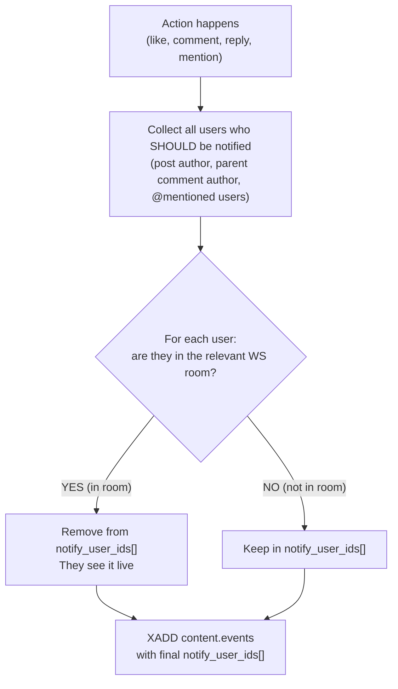
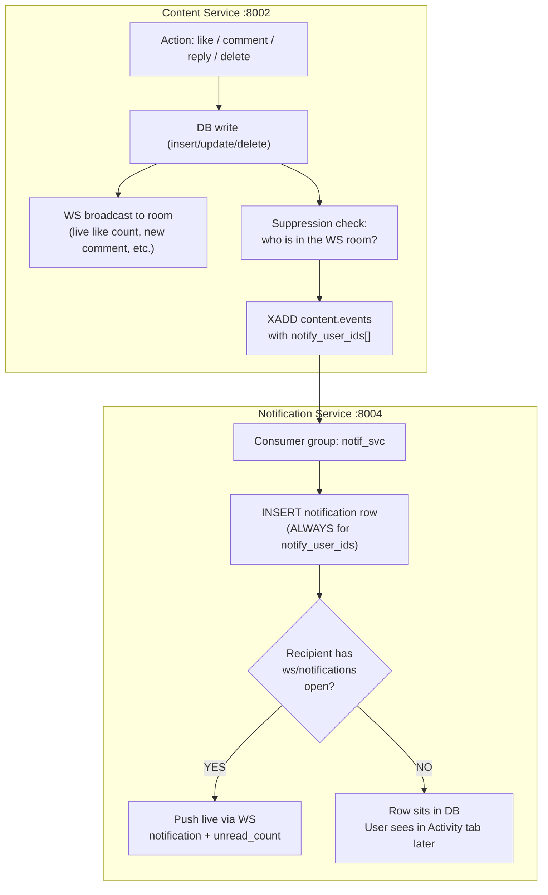

# Notification & Live Update Plan

> How notifications and real-time updates work across Content Service (`:8002`) and Notification Service (`:8004`).
> Two systems, two concerns: **live content** (WebSocket rooms) vs **notification bell** (WebSocket channel + DB persistence).

---

## Two Distinct Systems


| System                   | Owned by             | Purpose                                                       | When active                            |
| ------------------------ | -------------------- | ------------------------------------------------------------- | -------------------------------------- |
| **Live content rooms**   | Content Service      | Real-time like counts, new comments, replies appearing inline | User is viewing the post (in the room) |
| **Notification channel** | Notification Service | Bell badge, Activity tab, push alerts                         | Always (global WS + DB fallback)       |


These are independent. A user can be in both simultaneously. The key rule:

> **If you're already seeing it live in the room, don't also ring the bell.**

---

## Notification Triggers — Complete Matrix

### A. On YOUR OWN post (you are the post author)


| Event                             | You're in the post room? | What happens                                                                                                                       |     |
| --------------------------------- | ------------------------ | ---------------------------------------------------------------------------------------------------------------------------------- | --- |
| Someone **likes** your post       | YES                      | Live `like_count` update via WS → **no notification**                                                                              |     |
| Someone **likes** your post       | NO                       | **Notify**: type=`like`, actor=liker                                                                                               |     |
| Someone **comments** on your post | YES                      | Live `new_comment` appears inline via WS → **no notification**                                                                     |     |
| Someone **comments** on your post | NO                       | **Notify**: type=`comment`, actor=commenter                                                                                        |     |
| Mod/admin **deletes** your post   | —                        | **Always notify**: type=`post_deleted`, actor=mod/admin (no suppression — this is a moderation action, not content you'd see live) |     |


### B. On SOMEONE ELSE'S post (you're a participant)


| Event                                             | You're in the relevant room? | What happens                                                 |
| ------------------------------------------------- | ---------------------------- | ------------------------------------------------------------ |
| Someone **replies** to your comment               | YES (in thread room)         | Live `new_reply` appears inline via WS → **no notification** |
| Someone **replies** to your comment               | NO                           | **Notify**: type=`reply`, actor=replier                      |
| Someone **mentions** you (@username) in a comment | YES (in post/thread room)    | You see it inline via WS → **no notification**               |
| Someone **mentions** you in a comment             | NO                           | **Notify**: type=`mention`, actor=mentioner                  |
| Mod/admin **deletes** your comment                | —                            | **Always notify**: type=`comment_deleted`, actor=mod/admin   |


### C. Online AND in the room (live content)

No notifications. Instead, these WebSocket events deliver content in real time:


| WS Room                                 | Events pushed                | Trigger                                        |
| --------------------------------------- | ---------------------------- | ---------------------------------------------- |
| `ws/post/{post_id}`                     | `like_update { like_count }` | Any like/unlike on the post                    |
| `ws/post/{post_id}`                     | `new_comment { comment }`    | New top-level comment on the post [NOT NEEDED] |
| `ws/post/{post_id}/thread/{comment_id}` | `new_reply { comment }`      | Reply within that thread                       |

--- 


---

## Notification Types (updated)

```
reply            — someone replied to your comment
mention          — someone @mentioned you in a comment
like             — someone liked your post
comment          — someone commented on your post
post_deleted     — mod/admin deleted your post
comment_deleted  — mod/admin deleted your comment
```

Previous schema had `reply | mention | like`. Now extended with `comment`, `post_deleted`, `comment_deleted`.

---

## Suppression Logic — Who Decides

Content Service is the **gatekeeper**. It publishes events to Redis with a `notify_user_ids[]` field. Users who are already watching live are **excluded** from this list.

### Suppression flow (Content Service, at event publish time)




### Which room to check per event type


| Event                         | Check this room                                                                                     |
| ----------------------------- | --------------------------------------------------------------------------------------------------- |
| `post.liked`                  | `ws/post/{post_id}` — is the **post author** in the post room?                                      |
| `comment.created` (top-level) | `ws/post/{post_id}` — is the **post author** in the post room?                                      |
| `comment.created` (reply)     | `ws/post/{post_id}/thread/{root_comment_id}` — is the **parent comment author** in the thread room? |
| `comment.created` (mention)   | `ws/post/{post_id}` OR thread room — is the **mentioned user** in either?                           |
| `post.deleted`                | No check. **Always notify.**                                                                        |
| `comment.deleted`             | No check. **Always notify.**                                                                        |


---

## Event-by-Event Detailed Flow

### 1. Post Liked

```
User B likes User A's post #42

Content Service:
  1. INSERT post_likes, UPDATE post.like_count
  2. WS broadcast to room post:42 → { event: "like_update", like_count: 16 }
  3. Check: is User A (post author) in room post:42?
     YES → notify_user_ids = []
     NO  → notify_user_ids = [A]
  4. XADD content.events {
       type: "post.liked",
       post_id: 42, user_id: B, author_uname: "bob",
       like_count: 16, post_author_id: A, post_title: "...",
       tag_ids: [...], notify_user_ids: [A] or []
     }

Notification Service (consumer group: notif_svc):
  - If notify_user_ids includes A:
      1. INSERT notification (type=like, user_id=A, actor_id=B, ...)
      2. If A has ws/notifications open → push live
  - If notify_user_ids is empty → skip notification, only Feed Service processes this event
```

### 2. Top-Level Comment on Post

```
User B comments on User A's post #42

Content Service:
  1. INSERT comment, UPDATE post.comment_count
  2. WS broadcast to room post:42 → { event: "new_comment", comment: {...} }
  3. Parse content for @mentions → mentioned_user_ids = [C, D]
  4. Check: is User A (post author) in room post:42?
     YES → skip A from notify list
     NO  → include A (type=comment)
  5. For each mentioned user (C, D): is user in room post:42?
     YES → skip
     NO  → include (type=mention)
  6. XADD content.events {
       type: "comment.created",
       ..., notify_user_ids: [A?, C?, D?],
       notify_types: { A: "comment", C: "mention", D: "mention" }
     }

Notification Service:
  - For each user_id in notify_user_ids:
      INSERT notification with correct type per user
      Push live if connected to ws/notifications
```

### 3. Reply to Comment

```
User C replies to User B's comment in thread #10 on post #42

Content Service:
  1. INSERT comment (parent_id=10), UPDATE post.comment_count
  2. WS broadcast to room post:42/thread:10 → { event: "new_reply", comment: {...} }
  3. Parse content for @mentions → mentioned_user_ids = [D]
  4. Potential notify targets:
     - User A (post author)     → type=comment
     - User B (parent commenter) → type=reply
     - User D (@mentioned)       → type=mention
  5. Suppress checks:
     - User A: in room post:42? (post room, since they see comments there)
     - User B: in room post:42/thread:10? (thread room)
     - User D: in room post:42 OR post:42/thread:10?
  6. XADD with filtered notify_user_ids + per-user types
```

### 4. Post Deleted by Mod/Admin

```
Mod X deletes User A's post #42

Content Service:
  1. DELETE post (or soft-delete)
  2. Close WS room post:42 (disconnect all clients)
  3. XADD content.events {
       type: "post.deleted",
       post_id: 42, post_author_id: A,
       post_title: "How to learn Rust",
       deleted_by_id: X, deleted_by_uname: "mod_x",
       tag_ids: [...],
       notify_user_ids: [A]       ← always include post author
     }

Feed Service (consumer group: feed_svc):
  - Remove post_tags rows for post 42
  - Decrement tags.post_count

Notification Service (consumer group: notif_svc):
  - INSERT notification (type=post_deleted, user_id=A, actor_id=X, actor_uname="mod_x", ...)
  - Push live if A has ws/notifications open
```

### 5. Comment Deleted by Mod/Admin

```
Mod X deletes User B's comment #10 on post #42

Content Service:
  1. DELETE comment, UPDATE post.comment_count
  2. XADD content.events {
       type: "comment.deleted",
       post_id: 42, comment_id: 10, comment_author_id: B,
       post_title: "How to learn Rust",
       deleted_by_id: X, deleted_by_uname: "mod_x",
       notify_user_ids: [B]       ← always include comment author
     }

Notification Service:
  - INSERT notification (type=comment_deleted, user_id=B, actor_id=X, ...)
  - Push live if B has ws/notifications open
```

---

## Updated Redis Stream Event Contract

Stream: `content.events`


| Event             | Payload                                                                                                                                    | Consumers           |
| ----------------- | ------------------------------------------------------------------------------------------------------------------------------------------ | ------------------- |
| `post.created`    | `post_id, user_id, author_uname, title, tag_names[], tag_ids[]`                                                                            | feed_svc            |
| `post.liked`      | `post_id, user_id, author_uname, like_count, post_author_id, post_title, tag_ids[], notify_user_ids[]`                                     | feed_svc, notif_svc |
| `post.unliked`    | `post_id, user_id, like_count, tag_ids[]`                                                                                                  | feed_svc            |
| `comment.created` | `post_id, comment_id, parent_id, user_id, author_uname, content, post_author_id, post_title, tag_ids[], notify_user_ids[], notify_types{}` | feed_svc, notif_svc |
| `post.viewed`     | `post_id, user_id`                                                                                                                         | feed_svc            |
| `post.deleted`    | `post_id, post_author_id, post_title, deleted_by_id, deleted_by_uname, tag_ids[], notify_user_ids[]`                                       | feed_svc, notif_svc |
| `comment.deleted` | `post_id, comment_id, comment_author_id, post_title, deleted_by_id, deleted_by_uname, notify_user_ids[]`                                   | notif_svc           |


**New fields vs previous contract:**

- `post.liked` now includes `notify_user_ids[]` (previously notification was implicit)
- `comment.created` now includes `notify_types{}` (maps user_id → notification type)
- `post.deleted` — new event (previously only used by feed_svc for tag cleanup, now also triggers notification)
- `comment.deleted` — new event

---

## Updated Notification Schema

```dbml
Table notifications {
  id           int       [pk, increment]
  user_id      int       [not null, note: 'recipient']
  actor_id     int       [not null, note: 'who triggered it']
  actor_uname  varchar   [not null, note: 'denormalized from event payload']
  type         varchar   [not null, note: 'reply | mention | like | comment | post_deleted | comment_deleted']
  post_id      int       [note: 'thread context']
  post_title   varchar   [note: 'denormalized from event payload']
  comment_id   int       [note: 'set for reply/mention/comment_deleted, null for post-level events']
  is_read      boolean   [not null, default: false]
  created_at   timestamp

  indexes {
    (user_id, created_at) [note: 'Activity tab pagination']
    (user_id, is_read)    [note: 'unread count badge']
  }
}
```

Changes from previous:

- `type` expanded: added `comment`, `post_deleted`, `comment_deleted`
- `actor_id` / `actor_uname` for moderation events = the mod/admin who performed the action

---

## WebSocket Rooms — Live Content (Content Service)

### Post Room: `ws/post/{post_id}`

Client joins when opening a post detail page.

```
Events pushed:
  { "event": "like_update",  "like_count": 16 }
  { "event": "new_comment",  "comment": { id, author_uname, content, ... } }
  { "event": "post_deleted", "message": "This post has been removed by a moderator" }
```

`post_deleted` is a terminal event — after pushing it, the server closes the room and disconnects all clients.

### Thread Room: `ws/post/{post_id}/thread/{comment_id}`

Client joins when expanding a comment thread.

```
Events pushed:
  { "event": "new_reply", "comment": { id, parent_id, author_uname, content, ... } }
```

### Notification Channel: `ws/notifications`

Global per-user channel. Client opens on login.

```
Events pushed:
  { "event": "notification", "data": {
      "id": 100, "actor_uname": "bob", "type": "like",
      "post_id": 42, "post_title": "How to learn Rust",
      "comment_id": null, "created_at": "..."
  }}
  { "event": "unread_count", "count": 8 }
```

---

## Complete Flow Diagram




---

## Edge Cases


| Scenario                                                             | Handling                                                                                                                                                      |
| -------------------------------------------------------------------- | ------------------------------------------------------------------------------------------------------------------------------------------------------------- |
| **User is in post room AND has ws/notifications open**               | Suppression removes them from `notify_user_ids[]`. They see content live in the room. No notification bell rings. No DB row inserted.                         |
| **User opens post room AFTER the event**                             | Too late for live — but the notification was already created (they weren't in the room at event time). They see it in Activity tab.                           |
| **Self-actions** (liking your own post, commenting on your own post) | Content Service never includes the acting user in `notify_user_ids[]`. No self-notifications.                                                                 |
| **Mod deletes post while users are in the room**                     | WS `post_deleted` event sent to room → room closed. Post author gets notification regardless of room presence.                                                |
| **Multiple mentions in one comment**                                 | Deduplicate: each user appears in `notify_user_ids[]` at most once, with a single notification type (mention takes priority if they're also the post author). |
| **Rapid likes (10 users like in 1 second)**                          | Each produces a separate notification. v2 optimization: batch/aggregate into "10 people liked your post" — not in scope for v1.                               |


---

## Summary

```
Action happens in Content Service
  ├─ DB write (always)
  ├─ WS room broadcast (always, for anyone watching live)
  │     ├─ post room: like_update, new_comment, post_deleted
  │     └─ thread room: new_reply
  ├─ Suppression check: remove in-room users from notify list
  └─ XADD content.events with notify_user_ids[]
        │
        ├─ feed_svc consumer: update tag_weight, post_tags, etc.
        │
        └─ notif_svc consumer:
              ├─ INSERT notification row (for Activity tab)
              └─ If user has ws/notifications → push live (bell + badge)
```

**Three layers, three audiences:**


| Layer                  | Who sees it                      | How                               |
| ---------------------- | -------------------------------- | --------------------------------- |
| Live room              | Users currently viewing the post | WS post/thread room               |
| Live notification      | Users online but elsewhere       | WS /ws/notifications (bell badge) |
| Persisted notification | Users who are offline            | Activity tab on next visit        |


