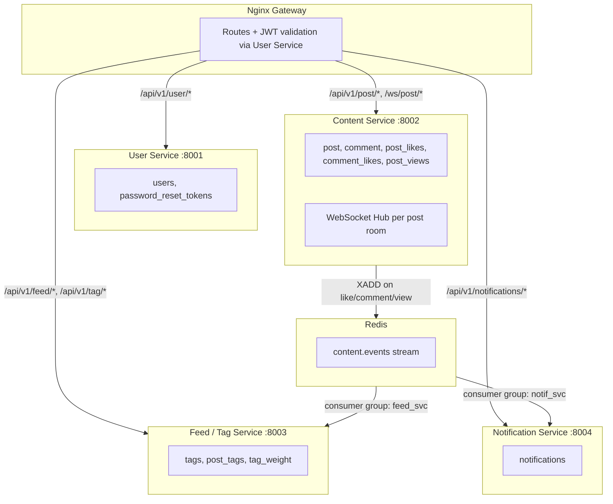
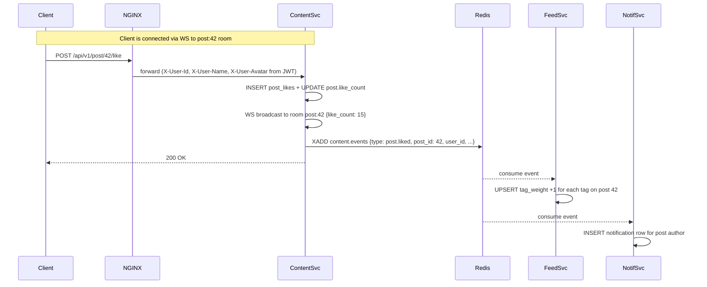

---

name: Microservice Schema Design
overview: Split the monolithic schema into 4 microservices (User, Content, Feed/Tag, Notification), each with its own database, denormalized fields to minimize cross-service REST calls, Redis Streams for async event propagation, and WebSocket in Content Service for live likes/comments.
todos:

- id: write-user-svc-schema
content: Write User Service DBML block in design.md (users + password_reset_tokens)
status: completed
- id: write-content-svc-schema
content: Write Content Service DBML block in design.md (post, comment, post_likes, comment_likes, post_views with denormalized fields)
status: completed
- id: write-feed-svc-schema
content: Write Feed/Tag Service DBML block in design.md (tags, post_tags, tag_weight)
status: completed
- id: write-notif-svc-schema
content: Write Notification Service DBML block in design.md (notifications with denormalized fields)
status: completed
- id: document-events-and-routes
content: Add Redis Stream event contract and Nginx route map as comments/notes in design.md
status: completed
isProject: false

---

# Microservice Architecture -- Schema Design

## Service Overview (4 services)




---

## How real-time works (zero inter-service calls on hot path)




- **Live likes**: Content Service broadcasts new `like_count` to the WebSocket room for that post. All clients viewing the thread see the count update instantly.
- **Live comments**: Same pattern -- Content Service inserts the comment, broadcasts the full comment payload to the room, clients render it immediately.
- **No REST between services** on this path. Feed and Notification services consume asynchronously from Redis Streams.

---

## Denormalization Strategy

**Gateway injects user info from JWT**: Nginx validates the JWT (by calling User Service once on first request, or by sharing the JWT secret) and passes `X-User-Id`, `X-User-Name`, `X-User-Avatar` as headers. Services use these directly at write time -- no need to call User Service.

### What gets denormalized where

- **Content Service**: `post` and `comment` store `author_uname` and `author_avatar` so the API can return complete objects without calling User Service
- **Content Service**: `post` stores `like_count` and `comment_count` so listing endpoints are a single query (no COUNT joins)
- **Content Service**: `comment` stores `like_count` for the same reason
- **Feed/Tag Service**: `tags.post_count` already denormalized (exists in current schema)
- **Notification Service**: `notifications` stores `actor_uname` and `post_title` so the Activity tab renders without cross-service calls

**Stale data trade-off**: If a user changes their username/avatar, the denormalized copies in other services become stale. Options (pick later):

- Accept staleness (simplest -- fine for an MVP)
- Content Service publishes a `user.profile_updated` event to Redis, other services update (eventual consistency)

---

## Per-Service Schema (DBML)

### 1. User Service DB

```dbml
Table users {
  id           int       [pk, increment]
  email        varchar   [unique, not null]
  uname        varchar   [unique, not null]
  password     varchar   [not null]
  avatar       varchar
  bio          text
  role         varchar   [not null, default: 'user', note: 'admin | mod | user']
  created_at   timestamp
}

Table password_reset_tokens {
  id           int       [pk, increment]
  user_id      int       [not null]
  token        varchar   [not null]
  expires_at   timestamp [not null]
  used         boolean   [not null, default: false]
  created_at   timestamp
}
```

No FKs to other services. `user_id` in other services is a logical reference, not a DB-level FK.

### 2. Content Service DB

```dbml
Table post {
  id             int       [pk, increment]
  user_id        int       [not null]
  author_uname   varchar   [not null, note: 'denormalized from User Service']
  author_avatar  varchar   [note: 'denormalized from User Service']
  title          varchar   [not null]
  content        text
  image_link     varchar
  like_count     int       [not null, default: 0, note: 'denormalized from post_likes']
  comment_count  int       [not null, default: 0, note: 'denormalized from comment']
  created_at     timestamp
  updated_at     timestamp
}

Table comment {
  id             int       [pk, increment]
  post_id        int       [not null, ref: > post.id]
  parent_id      int       [ref: > comment.id, note: 'null = top-level comment']
  user_id        int       [not null]
  author_uname   varchar   [not null, note: 'denormalized from User Service']
  author_avatar  varchar   [note: 'denormalized from User Service']
  content        text      [not null]
  like_count     int       [not null, default: 0, note: 'denormalized from comment_likes']
  created_at     timestamp
  updated_at     timestamp
}

Table post_likes {
  post_id      int       [not null, ref: > post.id]
  user_id      int       [not null]
  created_at   timestamp

  indexes {
    (post_id, user_id) [pk]
  }
}

Table comment_likes {
  comment_id   int       [not null, ref: > comment.id]
  user_id      int       [not null]
  created_at   timestamp

  indexes {
    (comment_id, user_id) [pk]
  }
}
```

Key points:

- `author_uname`, `author_avatar` on both `post` and `comment` -- populated from gateway headers at write time
- `like_count` on `post` and `comment` -- incremented/decremented atomically on like/unlike, avoids COUNT queries
- `comment_count` on `post` -- same pattern
- `user_id` columns are **not DB-level FKs** (no cross-DB reference), just logical IDs
- `post_id` and `comment_id` refs are local within this DB

### 3. Feed / Tag Service DB

```dbml
Table tags {
  id           int       [pk, increment]
  name         varchar   [unique, not null]
  post_count   int       [not null, default: 0, note: 'denormalized; updated via content.events']
  created_at   timestamp
}

Table post_tags {
  post_id      int       [not null]
  tag_id       int       [not null, ref: > tags.id]

  indexes {
    (post_id, tag_id) [pk]
    (tag_id, post_id) [note: 'reverse index for feed query']
  }
}

Table tag_weight {
  user_id      int       [not null]
  tag_id       int       [not null, ref: > tags.id]
  weight       float     [not null, default: 0, note: 'like: +1, comment: +5']
  updated_at   timestamp

  indexes {
    (user_id, tag_id) [pk]
    (user_id, weight) [name: 'idx_user_top_tags', note: 'fast top-K lookup for feed']
  }
}


Table post_views {
  post_id      int       [not null, ref: > post.id]
  user_id      int       [not null]
  viewed_at    timestamp

  indexes {
    (post_id, user_id) [pk]
  }
}
```

Key points:

- `post_id` in `post_tags` is a logical reference to Content Service's `post.id` (not a DB FK)
- `tag_weight` is updated by consuming `content.events` from Redis (like +1, comment +5)
- `tags.post_count` updated by consuming `content.events` (post created/deleted with tags)
- Feed build query: top-K tags by weight -> find post_ids via post_tags -> **single REST call to Content Service** to get post details for those IDs (the one cross-service call)

### 4. Notification Service DB

```dbml
Table notifications {
  id           int       [pk, increment]
  user_id      int       [not null, note: 'recipient']
  actor_id     int       [not null, note: 'who triggered it']
  actor_uname  varchar   [not null, note: 'denormalized -- for Activity tab display']
  type         varchar   [not null, note: 'reply | mention | like | comment | post_deleted | comment_deleted']
  post_id      int       [note: 'thread context']
  post_title   varchar   [note: 'denormalized -- for Activity tab display']
  comment_id   int       [note: 'set for reply/mention, null for post-level like']
  is_read      boolean   [not null, default: false]
  created_at   timestamp

  indexes {
    (user_id, created_at) [note: 'Activity tab pagination']
    (user_id, is_read)    [note: 'unread count badge']
  }
}
```

Key points:

- `actor_uname` and `post_title` denormalized so Activity tab renders with zero cross-service calls
- Populated from the Redis Stream event payload (Content Service includes this data when publishing)
- All IDs (`user_id`, `actor_id`, `post_id`, `comment_id`) are logical, not DB FKs

---

## Redis Stream Event Contract

All events published to `content.events`:

- **post.created**: `{post_id, user_id, author_uname, title, tag_names[], tag_ids[]}`
- **post.liked**: `{post_id, user_id, author_uname, like_count, post_author_id, post_title, tag_ids[], notify_user_ids[]}`
- **post.unliked**: `{post_id, user_id, like_count, tag_ids[]}`
- **comment.created**: `{post_id, comment_id, parent_id, user_id, author_uname, content, post_author_id, post_title, tag_ids[], notify_user_ids[], notify_types{}}`
- **post.viewed**: `{post_id, user_id}`
- **post.deleted**: `{post_id, post_author_id, post_title, deleted_by_id, deleted_by_uname, tag_ids[], notify_user_ids[]}`
- **comment.deleted**: `{post_id, comment_id, comment_author_id, post_title, deleted_by_id, deleted_by_uname, notify_user_ids[]}`

Content Service performs **suppression checks** before publishing: users currently in the relevant WS room are excluded from `notify_user_ids[]` (they see content live). Moderation events (`post.deleted`, `comment.deleted`) always notify — no suppression.

Each consumer group processes independently:

---

## Cross-Service REST Calls (minimal)

Only **two** REST endpoints between services:

1. **Gateway -> User Service**: `POST /internal/auth/validate` -- validate JWT, return user info (id, uname, avatar, role). Called once per request by Nginx (or use shared JWT secret to avoid even this).
2. **Feed Service -> Content Service**: `POST /internal/posts/batch` -- given a list of post IDs, return post details. Called during feed build only.

Everything else flows through Redis Streams events. No other service-to-service REST calls.

---

## Nginx Gateway Route Map

- `/api/v1/user/`* -> User Service :8001
- `/api/v1/post/`* -> Content Service :8002
- `/api/v1/comment/*` -> Content Service :8002
- `/ws/post/*` -> Content Service :8002 (WebSocket upgrade)
- `/api/v1/feed/*` -> Feed/Tag Service :8003
- `/api/v1/tag/*` -> Feed/Tag Service :8003
- `/api/v1/notifications/*` -> Notification Service :8004
- `/health` -> each service has its own health endpoint

---

## Summary of changes to [design.md](design.md)

Replace the current single-DB schema with 4 separate DBML blocks, one per service. Each block is self-contained with only local FKs. Cross-service references are documented as notes, not DB constraints.