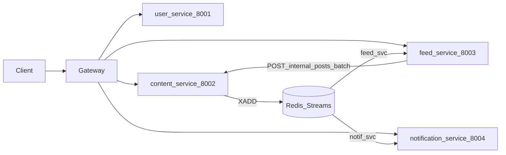

# Microservice project structure

This document describes a **beginner-friendly monorepo layout** for the backend described in [api.md](PROJECT/dbml/api.md), [paln_imp_cursor.md](paln_imp_cursor.md), [plan.md](PROJECT/dbml/plan.md), and [stories.md](stories.md). Use it as a map: **where code lives**, **which technology each piece uses**, and **how services connect**.

**Authoritative HTTP paths and ports** come from [api.md](PROJECT/dbml/api.md). [plan.md](PROJECT/dbml/plan.md) is an earlier route sketch; if anything disagrees, follow `api.md`.

---

## How to read this repo

1. **Start at the repo root** — one `pyproject.toml` can define a **uv workspace** so every service is a member package.
2. **Open `services/<name>/`** — each folder is one deployable FastAPI app with its own database and migrations.
3. **Follow the implementation order** — user → content → feed → notification (see [Local development order](#local-development-order)).

---

## Architecture snapshot

Four backend processes, one responsibility each. A gateway (for example Nginx) routes public traffic and, after JWT validation, forwards requests with headers such as `X-User-Id`, `X-User-Name`, `X-User-Avatar`, and `X-User-Role` ([api.md](PROJECT/dbml/api.md)).


| Service                  | Port | Responsibility                                                                                    |
| ------------------------ | ---- | ------------------------------------------------------------------------------------------------- |
| **user-service**         | 8001 | Auth, profile, admin user list/roles, `POST /internal/auth/validate`                              |
| **content-service**      | 8002 | Posts, comments, likes, views, `POST /internal/posts/batch`, **WebSockets** for post/thread rooms |
| **feed-service**         | 8003 | Personalized feed, tags, Redis consumer `feed_svc`, calls Content internal batch API              |
| **notification-service** | 8004 | Activity/notifications REST, **WebSockets** for live notifications, Redis consumer `notif_svc`    |


**Async integration:** Content Service appends events to a Redis Stream (for example `content.events`). Feed and Notification services consume with separate consumer groups — no hot-path REST between them ([paln_imp_cursor.md](paln_imp_cursor.md), [api.md](PROJECT/dbml/api.md) “Inter-Service Communication”).




---

## Tech stack


| Technology                  | Role                                                                                                                                 |
| --------------------------- | ------------------------------------------------------------------------------------------------------------------------------------ |
| **uv**                      | Python version pinning, fast installs, `uv run` for apps and scripts; optional **workspace** with multiple members under `services/` |
| **FastAPI**                 | One ASGI app per service; routers for HTTP (and WebSocket routes where needed)                                                       |
| **Pydantic**                | Request/response **schemas**; `pydantic-settings` (or equivalent) for typed configuration                                            |
| **PostgreSQL + SQLAlchemy** | **One database per service**; models and queries owned by that service only                                                          |
| **Alembic**                 | Migrations **inside each service** — never share one migration history across databases                                              |
| **Redis**                   | **Streams**: `XADD` from Content Service; consumer groups for Feed and Notification workers                                          |
| **WebSockets**              | **content-service**: `/ws/post/{post_id}` and thread rooms; **notification-service**: `/ws/notifications` ([api.md](PROJECT/dbml/api.md))         |


---

## Repository layout (monorepo)

One repository keeps paths predictable and matches how [stories.md](stories.md) epics map to code.

```text
practice/                          # repository root (name may vary)
├── pyproject.toml                 # uv workspace root: tool.uv.workspace members
├── README.md
├── services/
│   ├── user-service/
│   ├── content-service/
│   ├── feed-service/
│   └── notification-service/
├── packages/                      # optional — keep small
│   └── common/                    # shared constants or event payload types only; avoid a “god library”
└── infra/                         # optional: docker-compose, sample Nginx, env templates
```

---

## Layout inside each service

Use the **same shape** in every `services/<name>/` so beginners always know where to look.

```text
services/<service-name>/
├── pyproject.toml                 # dependencies; member of uv workspace
├── README.md                      # how to run migrations and the dev server
├── src/
│   └── <service_pkg>/             # e.g. user_service, content_service (single import root)
│       ├── main.py                # FastAPI app, include routers, lifespan (DB engine, Redis if needed)
│       ├── core/
│       │   └── config.py          # env-based settings (DATABASE_URL, REDIS_URL, secrets, URLs)
│       ├── api/
│       │   ├── deps.py            # get_db, optional user context from X-User-* headers
│       │   └── v1/                # routers: auth.py, posts.py, ... matching api.md base paths
│       ├── schemas/               # Pydantic models for JSON in/out
│       ├── models/                # SQLAlchemy models
│       ├── db/
│       │   └── session.py         # engine, session factory, Base
│       └── services/              # business logic (routers stay thin)
├── alembic/                       # migrations for this service’s DB only
├── tests/                         # pytest; httpx AsyncClient against the app
```

### Service-specific additions


| Service                  | Extra folders or files                                                                                                                        |
| ------------------------ | --------------------------------------------------------------------------------------------------------------------------------------------- |
| **user-service**         | `api/v1/internal.py` (or `internal/`) for `POST /internal/auth/validate` — not exposed through the public gateway the same way as user routes |
| **content-service**      | `ws/` or `api/ws.py` — WebSocket handlers, room registry (`post:{id}`, `post:{id}/thread:{comment_id}`), broadcast helpers                    |
| **feed-service**         | `workers/` or `consumers/` — Redis Streams consumer group `feed_svc`; HTTP client to `POST {CONTENT_SERVICE_URL}/internal/posts/batch`        |
| **notification-service** | `workers/` — consumer group `notif_svc`; `ws/` (or shared pattern) for `WS /ws/notifications`                                                 |


---

## Mapping stories and docs to services

Rough alignment with [stories.md](stories.md) epics:


| Epic area                                   | Primary service      |
| ------------------------------------------- | -------------------- |
| Authentication and account (AU-*)           | user-service         |
| Profile management (PR-*)                   | user-service         |
| Posts, comments, likes, search (post epics) | content-service      |
| Feed and tags                               | feed-service         |
| Notifications / activity                    | notification-service |


[paln_imp_cursor.md](paln_imp_cursor.md) describes **denormalized fields** (for example author name on posts) and **Redis event flow** — implement those rules in the service that owns the table or the producer (Content produces stream events; Feed/Notification consume).

---

## Environment variables (typical)

Set these per process (for example `.env` per service or one compose file with service blocks):


| Variable                       | Used by                       | Purpose                                                             |
| ------------------------------ | ----------------------------- | ------------------------------------------------------------------- |
| `DATABASE_URL`                 | All services                  | Async or sync PostgreSQL URL for **that** service’s DB              |
| `REDIS_URL`                    | content, feed, notification   | Streams and optional cache                                          |
| `JWT_SECRET` / issuer settings | user-service (validate/issue) | Tokens; gateway may share validation strategy with [api.md](PROJECT/dbml/api.md) |
| `CONTENT_SERVICE_URL`          | feed-service                  | `POST /internal/posts/batch`                                        |
| Port                           | each service                  | 8001–8004 as in [api.md](PROJECT/dbml/api.md)                                    |


Each service should expose `**GET /health`** for orchestration ([plan.md](PROJECT/dbml/plan.md) mentions health at the API root conceptually).

---

## Local development order

1. **PostgreSQL** — create four databases (or one server with four DB names), one per service.
2. **Redis** — required before running Feed and Notification consumers and Content stream producers.
3. **user-service** — register/login and internal validate underpin the gateway and headers.
4. **content-service** — posts and WebSockets; emits Redis events.
5. **feed-service** and **notification-service** — start workers that consume Redis and expose REST/WS.

Alternatively, use `**infra/docker-compose`** (when you add it) to bring up Postgres, Redis, and all apps together once images or `uv run` commands are wired.

---

## Related files


| File                                     | What it defines                                      |
| ---------------------------------------- | ---------------------------------------------------- |
| [api.md](PROJECT/dbml/api.md)                         | Endpoints, WebSocket URLs, pagination, internal APIs |
| [paln_imp_cursor.md](paln_imp_cursor.md) | Schema split, Redis streams, real-time sequence      |
| [plan.md](PROJECT/dbml/plan.md)                       | Early route notes — use `api.md` for final paths     |
| [stories.md](stories.md)                 | User stories, acceptance criteria, epics             |


---

## Summary

- **Four folders under `services/`**, same internal Python package layout, **Alembic per service**.
- **uv** at the repo root ties the workspace together.
- **FastAPI + Pydantic + SQLAlchemy** everywhere; **Redis Streams** for async; **WebSockets** in **content-service** and **notification-service** only, as specified in [api.md](PROJECT/dbml/api.md).

