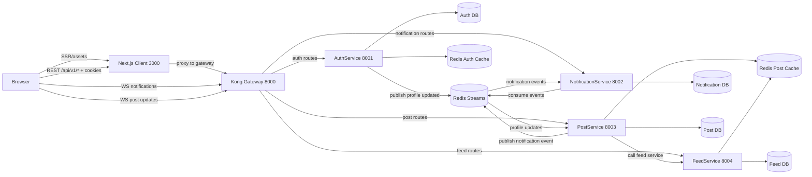

# 🚀 Project Preparation & Evaluation Checklist

---

## ✅ TODO — Functional Requirements

### 👤 User Management
- [x] User registration (email + password)
- [x] Login with JWT (access + refresh tokens)
- [x] Profile update (name, avatar, bio)

### 🔐 Role & Permission Management
- [x] Implement roles: Admin, Moderator, Member
- [x] Admin can promote/demote users
- [x] Members can edit/delete only their own content
- [x] Moderators can edit/delete any content

### 🧵 Threads & Comments
- [x] Create threads (title + description)
- [x] Thread listing with pagination
- [x] Multi-level nested comments
- [x] Like system (one like per user)
- [x] Show users who liked a thread (optional)
- [x] Edit/delete permissions enforced correctly

### ⚡ Real-Time Communication
- [x] WebSocket setup
- [x] Real-time thread updates
- [x] Instant comment delivery
- [x] Live like count broadcast

### 🔍 Search Functionality
- [x] Search by title
- [x] Search by tags
- [x] Search by content
- [x] Relevant ranking of results

### 🔔 Notification System
- [x] Notification on replies
- [x] @mention notifications
- [x] Real-time notification delivery

### 📊 Dashboards
- [x] Admin dashboard (user + role management)
- [x] Moderator dashboard (content moderation)
- [x] Member dashboard (threads, comments, notifications)

---

## ⚙️ TODO — Non-Functional Requirements

### 🧱 Code Quality
- [ ] Proper use of OOP (encapsulation, inheritance, polymorphism)
- [ ] Clean code structure (modules, packages)
- [ ] Separation of concerns

### 🐍 Python Best Practices
- [x] Use decorators where applicable
- [x] Implement context managers if needed
- [ ] Use generators efficiently

### 🛡️ Error Handling
- [ ] Custom exceptions
- [ ] Graceful error handling
- [ ] Meaningful error messages

### 📘 Readability & Documentation
- [x] Type hints
- [ ] Docstrings
- [x] Clean and readable code

### 🧩 Backend Engineering
- [x] REST API best practices (methods, status codes)
- [x] JWT authentication flow
- [x] Secure endpoints
- [ ] Database schema (normalized, indexed)
- [x] WebSocket integration
- [x] Docker setup (Dockerfile + docker-compose)
- [x] Environment variables management

---

## 🧠 Topics to Prepare (Problem Solving)

duplicate likes 

- [x] Breaking down complex systems
- [x] Handling edge cases:
  - Unauthorized actions
  - Concurrent updates
- [x] Pagination strategies
- [x] Search algorithms
- [x] Tree traversal (nested comments)
- [x] Debugging strategies
- [x] Role-based access control (RBAC logic)

---

## Communication Prep

- [x] Explain system design clearly
- [x] Justify tech choices (JWT, WebSocket, etc.)
- [x] Walk through code confidently
- [x] Handle follow-up questions
- [x] Explain technical concepts simply
- [x] Write clean README and API docs

---

## 📦 Project Demo Preparation

- [x] Smooth demo flow (no confusion)
- [x] End-to-end functionality works
- [x] No critical bugs during demo
- [x] Show best practices:
  - Input validation
  - Error handling
  - Security measures

---

## 📚 Study Plan ("Studying Stuff")

### Core Concepts
- [x] OOP in Python (deep understanding)
- [x] REST API design
- [x] Authentication (JWT deep dive)
- [x] Web Sockets (real-time systems)

### Backend & System Design
- [x] Database design (SQL/NoSQL tradeoffs)
- [ ] Indexing and performance
- [x] Scalable architecture basics

### Python Advanced
- [x] Decorators
- [ ] Generators
- [ ] Async programming (asyncio, websockets)

### DevOps Basics
- [ ] Docker fundamentals
- [ ] docker-compose
- [ ] Environment configs

### Debugging Skills
- [ ] Logging strategies
- [ ] Tracing bugs step-by-step
- [ ] Reading stack traces

---

## 📝 Final Notes

- Focus on **clarity over complexity**
- Ensure **everything works end-to-end**
- Be ready to **defend your decisions**
- Practice **explaining your code out loud**

---

