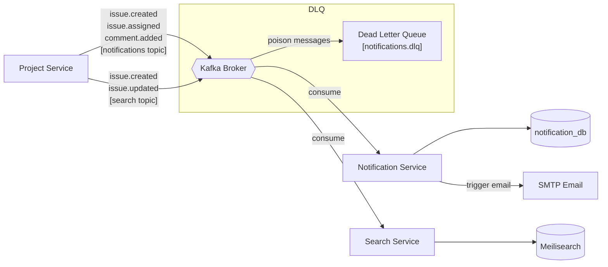

# notification and Event handelling

### 2.4 Event-Driven Pipeline

```mermaid

flowchart LR

    PS["Project Service"]

    KF{{"Kafka Broker"}}

    NS["Notification Service"]

    SS["Search Service"]

    DB1[("notification_db")]

    DB2[("Meilisearch")]

    SMTP["SMTP Email"]

  

    PS -->|"issue.created\nissue.assigned\ncomment.added\n[notifications topic]"| KF

    PS -->|"issue.created\nissue.updated\n[search topic]"| KF

  

    KF -->|consume| NS

    KF -->|consume| SS

  

    NS --> DB1

    NS -->|"trigger email"| SMTP

  

    SS --> DB2

  

    subgraph DLQ

        KF -->|"poison messages"| DLQ_T["Dead Letter Queue\n[notifications.dlq]"]

    end

```